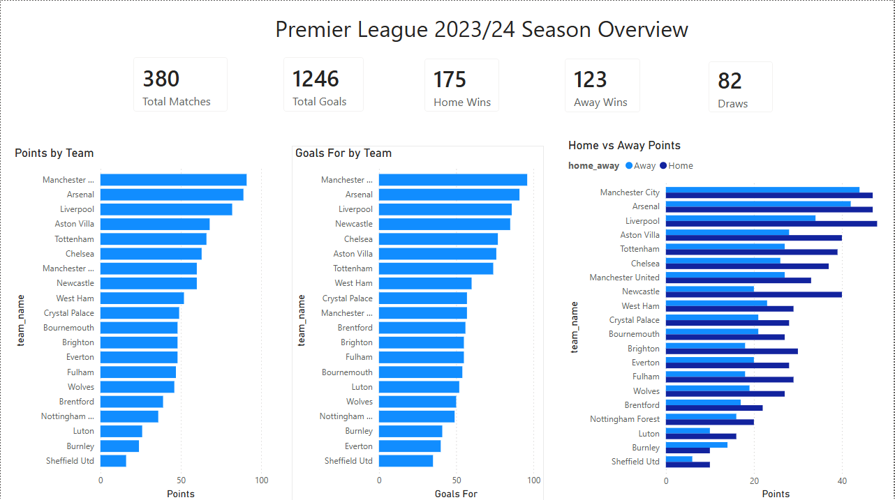

<div align="center">

# ⚽ Football Analytics & ML Pipeline

**End-to-end football data pipeline for data collection, BigQuery storage, dbt transformation, Power BI reporting, machine learning evaluation, and GitHub Actions automation.**

<br>


</div>

---

## 📌 Project Overview

This project demonstrates a complete football analytics pipeline.

It collects football match data from API-Football, stores raw data in BigQuery, transforms it with dbt, builds dashboard-ready tables for Power BI, creates an ML-ready feature table, compares simple prediction models, tracks experiments with MLflow, and automates the data engineering pipeline with GitHub Actions.

In simple terms:

```text
Football API
→ Python ingestion
→ BigQuery raw table
→ dbt staging, intermediate, and mart models
→ Power BI dashboard
→ ML feature table and model evaluation
→ GitHub Actions automation
```

---

## 🎯 Project Purpose

This is a portfolio project built to show practical skills across:

* API data extraction
* Python scripting
* BigQuery cloud data warehousing
* dbt SQL transformations
* dbt tests and documentation
* Power BI dashboarding
* ML feature preparation and model comparison
* MLflow experiment tracking
* GitHub Actions automation
* branch-based Git workflow

The project is not only a dashboard. It is an end-to-end analytics and introductory ML pipeline.

---

## 🏗️ Pipeline Architecture

```text
API-Football
    ↓
Python ingestion scripts
    ↓
Raw JSON / JSONL files
    ↓
BigQuery raw fixtures table
    ↓
dbt transformations
    ↓
BigQuery mart tables
    ↓
Power BI dashboard
    ↓
ML-ready feature table
    ↓
Model training and evaluation
```

The automated GitHub Actions pipeline runs:

```text
fetch API data
→ prepare JSONL
→ load raw data to BigQuery
→ run dbt models
→ run dbt tests
```

Full automation details are documented in [docs/automation.md](docs/automation.md).

---

## 🧱 Main Components

### Data Ingestion

Python scripts fetch Premier League fixture data from API-Football and prepare it for BigQuery loading.

Main scripts:

```text
ingestion/fetch_data.py
ingestion/prepare_bigquery_jsonl.py
ingestion/load_bigquery.py
```

### BigQuery and dbt

BigQuery is used as the cloud data warehouse.

The project uses:

```text
football_raw
football_dbt
```

`football_raw` stores raw API data.

`football_dbt` stores clean dbt models for analytics, dashboarding, and machine learning.

dbt creates:

```text
staging models
intermediate models
mart models
ML feature mart
```

### Power BI Dashboard

The Power BI dashboard shows a Premier League 2023/24 season overview.

It includes:

* total matches
* total goals
* home wins
* away wins
* draws
* points by team
* goals by team
* home vs away performance



More dashboard details are in [dashboards/powerbi/README.md](dashboards/powerbi/README.md).

### Machine Learning

The project includes an ML-ready dbt mart:

```text
football_dbt.ml_match_features
```

The prediction target is:

```text
target_match_result = Home Win / Draw / Away Win
```

The ML layer uses leakage-safe pre-match features only. Outcome columns such as goals, result labels, and win/draw flags are kept for reference but excluded from model inputs.

Models included:

```text
Baseline Logistic Regression
Balanced Logistic Regression
Random Forest
Tuned Random Forest
```

The ML layer compares baseline models for match-result prediction.

Detailed ML results and scripts are documented in [ml/README.md](ml/README.md).

---

## ✅ Current Status

The project is portfolio-ready as an end-to-end football analytics pipeline.

The data engineering workflow is automated with GitHub Actions:

```text
API fetch → BigQuery load → dbt run → dbt test
```

The project also includes a Power BI dashboard and an ML layer for match-result prediction. The current ML results provide a baseline benchmark that can be improved with more seasons of data and richer pre-match features.

---

## 🛠️ Tech Stack

| Area | Tools |
| --- | --- |
| Programming | Python |
| Data Source | API-Football |
| Raw Storage | Local JSON / JSONL |
| Cloud Warehouse | Google BigQuery |
| Transformation | dbt |
| Dashboard | Power BI |
| Machine Learning | Scikit-learn |
| Experiment Tracking | MLflow |
| Automation | GitHub Actions |
| Version Control | Git & GitHub |

---

## 📂 Project Structure

```text
football-analytics-pipeline/
├── .github/
│   └── workflows/
│       ├── ci.yml
│       └── full_pipeline.yml
│
├── dashboards/
│   └── powerbi/
│
├── data/
│   └── raw/
│
├── dbt_project/
│   ├── models/
│   │   ├── staging/
│   │   ├── intermediate/
│   │   └── marts/
│   └── tests/
│
├── docs/
│   └── automation.md
│
├── ingestion/
│   ├── fetch_data.py
│   ├── prepare_bigquery_jsonl.py
│   └── load_bigquery.py
│
├── ml/
│   ├── README.md
│   ├── train_baseline_model.py
│   ├── train_balanced_logistic_regression.py
│   ├── train_random_forest_model.py
│   ├── evaluate_stratified_k_fold.py
│   └── tune_random_forest_grid_search.py
│
├── README.md
└── requirements.txt
```

---

## 🚀 How to Run Locally

Install dependencies:

```bash
pip install -r requirements.txt
```

Run lightweight checks:

```bash
python -m compileall -q ingestion ml
cd dbt_project
dbt parse
cd ..
```

Fetch football data:

```bash
python ingestion/fetch_data.py
```

Prepare the JSONL file:

```bash
python ingestion/prepare_bigquery_jsonl.py
```

Load raw data to BigQuery:

```bash
python ingestion/load_bigquery.py
```

Run dbt:

```bash
cd dbt_project
dbt run
dbt test
```

Run model comparison:

```bash
python ml/evaluate_stratified_k_fold.py
```

Start MLflow UI:

```bash
python -m mlflow ui --backend-store-uri sqlite:///mlflow.db
```

---

## 🔐 Environment Variables and Secrets

Local `.env` file:

```text
FOOTBALL_API_KEY=your_api_key_here
```

GitHub Actions secrets:

```text
FOOTBALL_API_KEY
GCP_SERVICE_ACCOUNT_KEY
```

GitHub Actions uses repository secrets for the API key and Google Cloud authentication.

For setup details, see [docs/automation.md](docs/automation.md).

---

## 🤖 Automation

The project has two GitHub Actions workflows:

| Workflow | Purpose |
| --- | --- |
| `ci.yml` | Lightweight checks for Python syntax and dbt parsing. |
| `full_pipeline.yml` | Full automated data engineering pipeline. |

The full pipeline runs daily and can also be started manually from GitHub Actions.

For setup and troubleshooting, see [docs/automation.md](docs/automation.md).

---

## 🧪 Data Quality

The dbt project includes generic and custom tests.

Examples:

* important IDs are not null
* match IDs are unique
* match result values are accepted
* points equal wins multiplied by 3 plus draws
* matches played equal wins plus draws plus losses
* goal difference equals goals for minus goals against

Run tests with:

```bash
cd dbt_project
dbt test
```

---

## 🗺️ Roadmap

### Possible Future Improvements

* [ ] Add more seasons of football data
* [ ] Add better pre-match features
* [ ] Add Power BI scheduled refresh
* [ ] Reduce Google Cloud service account permissions
* [ ] Add richer dbt documentation pages

---

## 📚 More Documentation

| Topic | Link |
| --- | --- |
| Machine Learning | [ml/README.md](ml/README.md) |
| Automation | [docs/automation.md](docs/automation.md) |
| Dashboard | [dashboards/powerbi/README.md](dashboards/powerbi/README.md) |

---

## 👤 Author

Created by **Ibne Sina Khan**

This project is part of a portfolio focused on data analytics, cloud data pipelines, automation, and machine learning.
